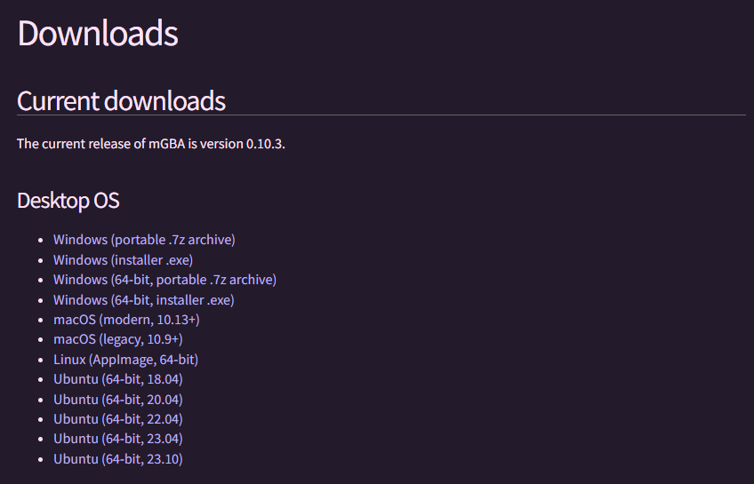

### 3rd Gen Auto Soft Reset

---
## 0. Introduction

3rd Gen Auto Soft Reset is a combination of Lua and Python scripting that automates the process of soft reseting for static shinies. This is accomplished by template matching for specific images, then checking if the SID is less than 8. *Note: This program does not work for Pokemon Emerald, since the game has broken RNG*

<div style="display: grid">


</div>

---
## 1. Preparation

To run these scripts, you will need both Lua and Python Conda installed on your computer. You may need several other libraries as well, including Lua Socket, OpenCV, and PyAutoGUI, depending on the version of Lua/Python you have downloaded. You will also need to download GameBoy emulator mGBA, since we will be taking advantage of its scripting capabilities.


<div style="display: grid;">


</div>

---
## 2. Installation

All you need to do for installation is download the zip file from this repository. Store the contents wherever you please.

---
## 3. Customization

There are several lines in the Python script that are customized to my inputs and graphical settings, so you will most likely have to make small alterations before continuing. First, check if my button mapping match yours.

```
pydirectinput.press("z")
pydirectinput.press("x")
pydirectinput.keydown("ctrl")
pydirectinput.press("r")
pydirectinput.keyup("ctrl")
pydirectinput.keydown("enter")
pydirectinput.press("left")
pydirectinput.keyup("enter")
```

*Z = A, Enter = Start, Left = Left Arrow, Ctrl + R = Reset*

Next, you will want to take a picture of your fight box and save it as *fightBox.png* for Fire Red/Leaf Green or *fightBoxRS.png* for Ruby/Sapphire in the assets directory. This is because in-game settings and emulator settings may vary from user to user. Please open my original image before saving over it for an example of what the image is supposed to be.


Your fight box image will impact the value of *thr*, A.K.A the template matching threshold in the function *matchTemplate(img,template)*. This value is higher for a more strict threshold and lower for a less strict threshold of matching your fight box to the current screenshot. Ideally, it would return a positive match for the fight box screen but would fail against the subsequent box containing your Pokemon's moves. Since we reset before getting to the second box in the vanilla version of this script, this would only matter if you wish to alter the script further.

```
def matchTemplate(img, template):
    result = cv2.matchTemplate(img, template, cv2.TM_SQDIFF_NORMED)
    min_val = cv2.minMaxLoc(result)[0]
    thr = .05
    return min_val <= thr
```

The last and smallest options for customization are the timer and the sound clip. On Line 68, there is a 1.5/2 second delay to make sure that the program always takes a picture of the fight box before pressing an additional input. You may need to adjust this higher or lower depending on your emulation speed. For reference, my emulator runs at 60 fps.

```
sleepCount = 2

time.sleep(sleepCount)
```

Lastly, there is a sound clip that plays after you catch a shiny on Line 82 and Line 120. If you wish to disable that, simply delete it or comment it out.

```
playsound("./assets/shinysound.mp3",block=False)
```

---
## 4. Execution

After the installation/customization is complete, it is finally time for execution. Place your character in front of the static Pokemon or object (a spot where you only need to press A to continue). *Note: the game re-navigates left/right if you are hunting for Treecko or Mudkip.* Save and close mGBA, reopen it, and set the window to full screen on your main monitor. First, load the script by navigating to Tools > Scripting. Select File > Load Script in the pop up window and select *main.lua*.


You will only see this message that reads *Socket Server Test: Listening on port 8888*. This is correct, and the rest of the script will load after you launch the game. Next, have the Python script *main.py* ready to go (either pre typed into a terminal or get ready to press play in your IDE). Load a Gen 3 Pokemon ROM, navigate over to your terminal/IDE, and then activate the Python script. **If you are NOT resetting for a starter, it is crucial that you wait for the Lua script to load your party Pokemon first. This will occur after the first 2/3 seconds of loading the ROM. This is so the scipt knows which Pokemon to check (Wild instead of Slot 1).** You will have about 2-3 seconds before your first action, which should give you plenty of time to re-navigate over to mGBA. Leave mGBA in focus and you are good to go! Side note: the mGBA scripting window indicates that you can press Shift + Left or Shift + Right to view different Pokemon. Do not do this or else your next encounter will be invalidated. Happy hunting :3
